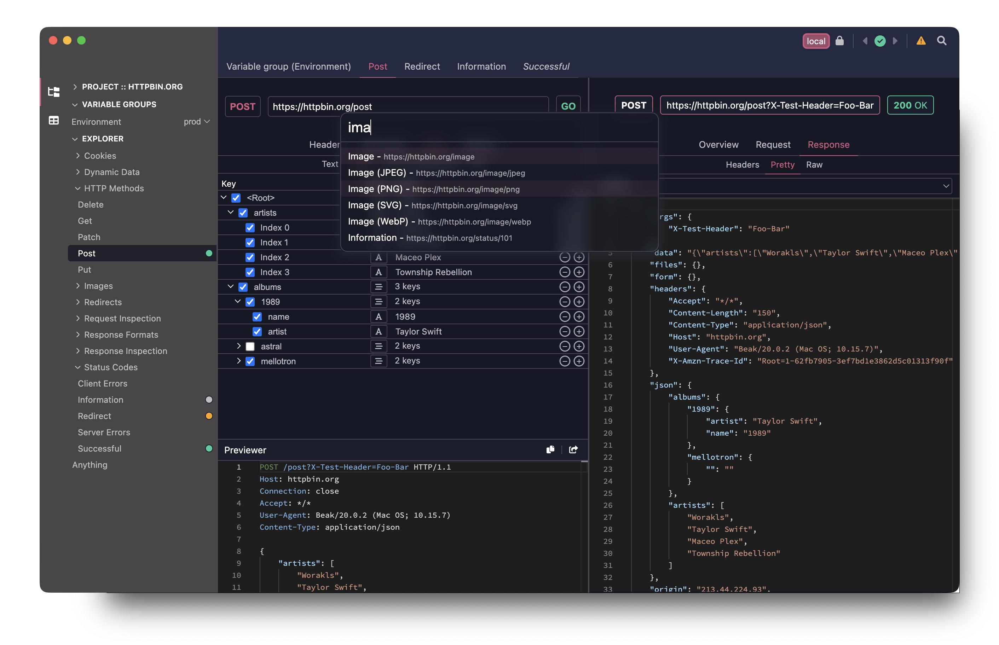

	

	
	

<h2 style="border-bottom: none" align="center">Beak</h1>

<h3 align="center">
	The feathery cross-platform API crafting tool.
</h3>

<picture>
	<source media="(prefers-color-scheme: light)" srcset="assets/home-light.png" type="image/png">
	<source media="(prefers-color-scheme: dark)" srcset="assets/home-dark.webp" type="image/webp">
	<source media="(prefers-color-scheme: light)" srcset="assets/home-light.png" type="image/png">
	<source media="(prefers-color-scheme: dark)" srcset="assets/home-dark.webp" type="image/webp">
	
</picture>

Beak is a simple, extensible, and powerful API creation and management tool. Built using Electron, React, and Redux but striving for native levels of performance.

Beak includes:
- Powerful feature set for creating APIs interactions
- Variables, which allow you to use dynamic values in requests
- Variable Sets, which allow you to group variables together and easily switch between sets
- An extensions API to create custom Beak Variables
- Un-opinionated project syncing, just use the version control of your choice
- Beautiful design language
- And of course, fully cross platform

To get started visit the [Beak manual](https://docs.getbeak.app).

## Download

Visit [https://getbeak.app/](https://getbeak.app/#downloads) to download Beak for Mac and Windows.
